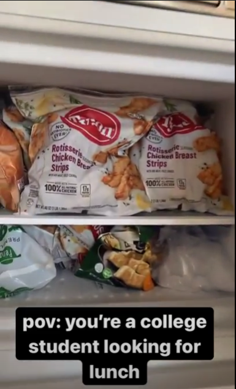
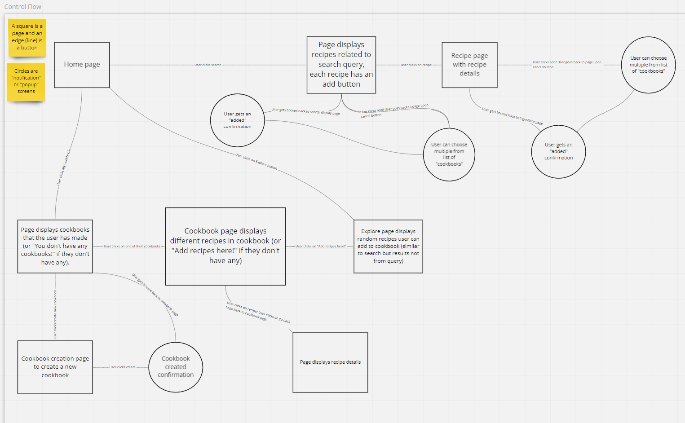

# Impasta Rosta Pitch

## The Problem

Food. We all eat it. And yet, not all of us know how to make it. According to the US Department of Agriculture, millennials like us consume food from a restaurant 30% more than any other generation. It makes sense: less dishes, less work, more time to do other things. But when our most convenient option for food as college students is most likely McDonalds, or any other fast food restaurant, it becomes clear that eating out is not the most sustainable option. However, learning to cook isn’t the easiest thing to do either. It requires tools and experience. A lot of it. And so, we have Impasta Rosta.

## Appetite

Before I started living near campus, my parents gave me a recipe for steamed egg. They texted me a link to a cooking site, and I ended up in the kitchen, cracking three eggs, pouring three cups of water, and beating and steaming the mixture. However, what I got looked nothing like what was in the picture. I've tried to make that egg seven times over the past two months. Only one of them was a success, and I have no recollection of what I did to make that happen. It was safe to say, however, that there was no way that I was going to keep notes of my process in my notebook. Now, my refrigerator looks like this:

So, what if we made a recipe app that allowed an adaptive cooking process for beginners? One in which users could search recipes, save them, and have the ability to explore cooking in their own way? That is the idea behind our app, Impasta Rosta.

## Out Target Audience

From our original problem statement, it would seem obvious to gear our application towards young adults with little to no cooking experience. However, we decided to generalize our audience to all beginner cooks, which could range from people with zero cooking knowledge to amateur cooks. Since many members of our team are beginner cooks as well, it will be easier for us to understand the perspective of our users, and we can draw from our own cooking experiences when designing the application. Aside from young adult cooks, we are also considering middle aged cooks

[insert Marienne persona]

and elderly cooks

[insert Carrie persona]

By considering beginner cooks from various age groups, we are also looking to design the application in such a way that it accommodates differing levels of technology experience. That way, our application will feel beginner friendly as well as being geared towards beginners.

## Solution

Here is our solution:

The main focus of our web app is for beginners to be able to easily locate recipes, save them to a virtual cookbook, and get cooking. Users will start at the home page. From there, users can create a cookbook, complete with a name and description. They will also be able to search for recipes from there, adding any appealing recipes to their cookbook. Users will also be able to create and edit any recipes to their liking, in order to personalize their cooking process. In each recipe, users will be able to see the name of the recipe, image of the finished product, a description, serving size, cooking time, ingredients list, and instructions for the dish. If they get tired of the dish, added it on accident, or for any reason need to remove the dish from their cookbook, they can delete the dish as well. These are the main features of our core product.

## Risks and Rabbit Holes

## Out of Scope Ideas
